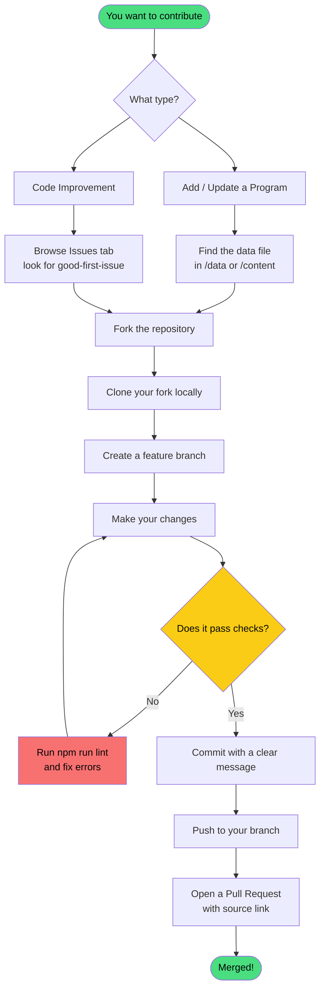
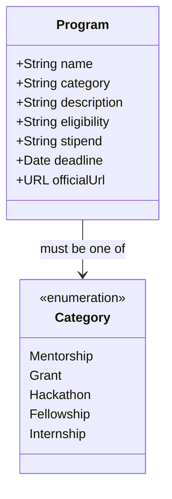
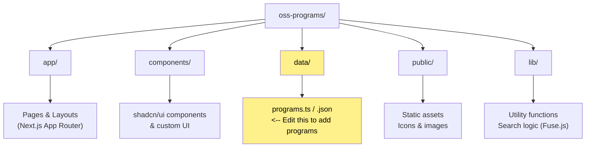

<div align="center">

# OSS Programs

### Your one-stop directory for open source opportunities

A curated, community-maintained hub for **mentorship programs, grants, fellowships, hackathons, and internships** — with deadline tracking, stipend info, and calendar exports.

[](https://nextjs.org/)
[](https://www.typescriptlang.org/)
[](LICENSE)
[](CONTRIBUTING.md)
[](https://owasp.org/)

[Live Site](#) · [Report a Bug](https://github.com/OWASP-STUDENT-CHAPTER/oss-programs/issues) · [Request a Program](https://github.com/OWASP-STUDENT-CHAPTER/oss-programs/issues/new)

</div>

---

## Features

| Feature | Description |
|---|---|
| **Deadline Tracking** | Never miss an application window |
| **Search & Filter** | Filter by category, stipend, eligibility, and region |
| **Calendar Export** | One-click export to Google, Apple, or Outlook Calendar |
| **Global Coverage** | Programs from organizations worldwide |
| **Stipend Info** | Compensation details visible at a glance |
| **Fuzzy Search** | Fast, typo-tolerant search powered by Fuse.js |

---

## Supported Programs

| Program | Category | Stipend |
|---|---|---|
| Google Summer of Code (GSoC) | Mentorship | Paid |
| Outreachy | Mentorship | Paid |
| MLH Fellowship | Fellowship | Paid |
| LFX Mentorship | Mentorship | Paid |
| Hacktoberfest | Hackathon | Swag |
| Mozilla Fellowship | Fellowship | Paid |
| NLnet NGI Zero | Grant | Paid |
| And more... | Various | Various |

---

## Tech Stack

```
OSS Programs
├── Framework     → Next.js 16
├── Language      → TypeScript 5
├── Styling       → Tailwind CSS
├── UI Components → shadcn/ui
└── Search        → Fuse.js (fuzzy search)
```

---

## Getting Started

### Prerequisites

- Node.js `v18+`
- npm `v9+`

### Installation

```bash
# 1. Clone the repository
git clone https://github.com/OWASP-STUDENT-CHAPTER/oss-programs.git
cd oss-programs

# 2. Install dependencies
npm install

# 3. Start the development server
npm run dev
```

Open [http://localhost:3000](http://localhost:3000) to view the app in your browser.

---

## Contributing

We rely on community contributions to keep program deadlines, stipends, and links accurate. All contributions are welcome — whether you're fixing a typo, adding a new program, or improving the UI.

### Contribution Workflow



---

### Step-by-Step Guide

**1. Fork & Clone**

```bash
git clone https://github.com/YOUR-USERNAME/oss-programs.git
cd oss-programs
```

**2. Create a Feature Branch**

```bash
git checkout -b update/gsoc-2026-deadlines
```

> Use descriptive branch names like `add/program-name` or `fix/broken-link`.

**3. Run Locally**

```bash
npm install
npm run dev
```

**4. Lint Your Code** *(for TypeScript/React changes)*

```bash
npm run lint
```

**5. Commit & Push**

```bash
git commit -m "Update GSoC 2026 application deadlines and stipend amounts"
git push origin update/gsoc-2026-deadlines
```

**6. Open a Pull Request**

In your PR description, include:
- What program you added or what you changed
- A link to the official source for verification

---

### Adding a New Program

When submitting a new program, make sure your entry includes all of the following fields:



| Field | Description | Example |
|---|---|---|
| `name` | Official program name | `"Google Summer of Code"` |
| `category` | One of: Mentorship, Grant, Hackathon, Fellowship | `"Mentorship"` |
| `description` | Max 3 sentences | `"GSoC is a global program..."` |
| `eligibility` | Who can apply | `"University students, Global"` |
| `stipend` | Compensation details | `"$1500–$6600 USD"` or `"Unpaid"` |
| `deadline` | ISO 8601 format | `"2026-04-01"` |
| `officialUrl` | Link to the official page | `"https://summerofcode.withgoogle.com"` |

---

### Good First Issues

New to the project? Start here:

1. Go to the [Issues tab](https://github.com/OWASP-STUDENT-CHAPTER/oss-programs/issues)
2. Filter by **`good first issue`** or **`help wanted`**
3. Comment on the issue to claim it before starting

---

## Project Structure



> **To add or update a program**, you'll primarily be working inside the `data/` directory.

---

## License

This project is licensed under the **MIT License** — see the [LICENSE](LICENSE) file for details.

---

## Acknowledgments

Built by the [OWASP Student Chapter](https://owasp.org/) to help students and developers discover open source opportunities worldwide.

**Want to see a program added? [Open an issue](https://github.com/OWASP-STUDENT-CHAPTER/oss-programs/issues/new)**

---

<div align="center">

**Star this repo if it helped you find an opportunity!**

</div>
